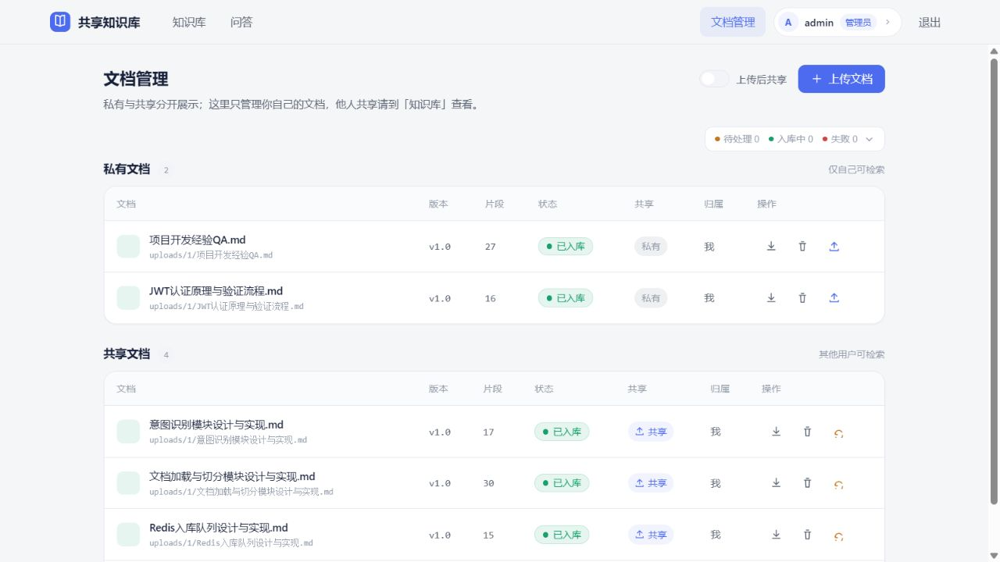
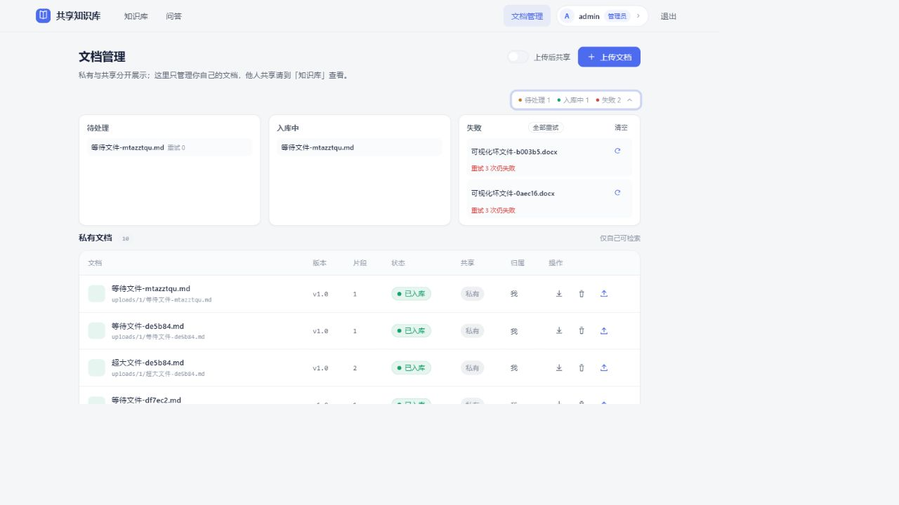
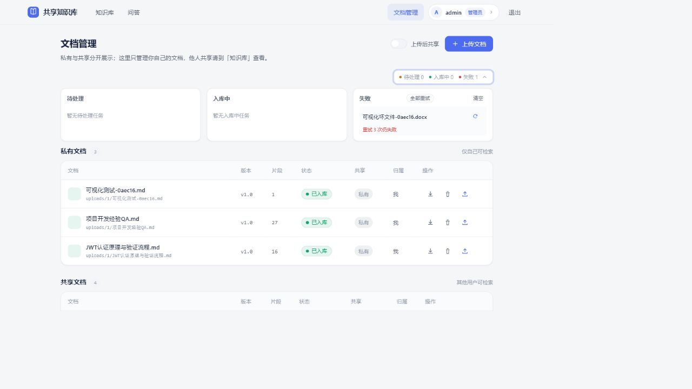

# 入库队列测试报告

- 测试日期：2026-08-27
- 测试方式：自动化（后端 API + 前端浏览器可视化验证）
- 测试范围：入库任务队列（Redis Streams）全链路

---

## 一、测试概述

验证「文档上传 → 入库队列 → 异步入库 → 文档落库」的完整链路，覆盖批量上传、队列统计/管理接口、失败重试、死信处理、恢复重试、缓存联动以及前端队列面板展示。

## 二、测试环境

| 组件 | 配置 |
|---|---|
| 后端 | FastAPI + uvicorn，端口 8010（`rag个人知识库.api.main`） |
| 前端 | Vite + Vue3，端口 5173（`/api` 代理到 8010） |
| 队列 | Redis Streams（`ingest_queue` / `ingest_queue:dead`，消费组 `ingest_workers`） |
| 数据库 | MySQL（文档元数据）/ Postgres（对话记忆）/ Milvus（向量） |
| 测试账号 | admin（管理员，user_id=1） |
| 测试文件 | 有效 `.md` ×N、损坏 `.docx` ×2（非 zip 内容的假文件）、超大 `.md`（约 8MB） |

## 三、测试用例与结果汇总

| # | 用例 | 预期 | 结果 |
|---|---|---|---|
| 1 | 队列基础状态查询 | stats/queue/inflight/dead 正常返回且初始为空 | ✅ 通过 |
| 2 | 批量上传（2 有效 + 1 损坏） | 3 个文件全部入队 | ✅ 通过 |
| 3 | 入队后状态 | stream_len=3、inflight=3 | ✅ 通过 |
| 4 | 有效文件异步入库 | 文档出现且 `in_sync`、chunk 数>0 | ✅ 通过 |
| 5 | 损坏文件重试 | 指数退避 2s/4s 重试 3 次 | ✅ 通过 |
| 6 | 失败进死信 | dead_letter 出现，error=「重试 3 次仍失败」 | ✅ 通过 |
| 7 | 失败后 inflight 清理 | 失败文件不再出现在「入库中」 | ✅ 通过 |
| 8 | 死信单条重试 retry_dead | 重新入队返回新 msg_id | ✅ 通过 |
| 9 | 死信全部重试 retry_all_dead | 重试计数重置并重新入队 | ✅ 通过 |
| 10 | 清空死信 clear_dead | dead_letter 归零 | ✅ 通过 |
| 11 | 流增长控制 | 处理完的消息 XDEL，stream 不无限增长 | ✅ 通过 |
| 12 | 文件删除后重试任务 | 「文件已不存在」自动跳过，不误报失败 | ✅ 通过 |
| 13 | 上传大小限制 | >10MB 文件被拒（不入队） | ✅ 通过 |
| 14 | 缓存联动 | 入库完成后文档列表缓存（`docs:`）失效 | ✅ 通过 |
| 15 | 前端队列面板 | 待处理/入库中/失败计数与详情正确展示 | ✅ 通过 |
| 16 | 前端定时轮询 | 队列状态每 5s 自动刷新（不手动刷新页面也能看到失败数变化） | ✅ 通过 |

## 四、详细测试记录

### 1. 队列基础状态（测试前）

```json
{"enabled": true, "stream_len": 0, "pending": 0, "dead_letter": 0, "inflight": 0}
```
文档总数：7。

### 2. 批量上传（2 个有效 .md + 1 个损坏 .docx）

接口：`POST /api/documents/upload`（multipart，`is_public=false`）

```
status: processing  accepted: 3  failed: 0
qtest-A-*.md        -> processing 已提交入库队列
qtest-B-*.md        -> processing 已提交入库队列
qtest-bad-*.docx    -> processing 已提交入库队列
```

入队后立即查询：

```json
stats: {"stream_len": 3, "pending": 1, "inflight": 3, "dead_letter": 0}
inflight: ["qtest-A-*.md", "qtest-B-*.md", "qtest-bad-*.docx"]
```

### 3. 有效文件异步入库

等待约 1~2s 后，两个 .md 出现在文档列表：

```
qtest-A-*.md | status: in_sync | chunks: 1 | public: false
qtest-B-*.md | status: in_sync | chunks: 1 | public: false
```

后端日志：

```
[Ingest] 全新入库 v1.0：...qtest-B-*.md，chunk 数 1
[Ingest] ...处理完成：{'added': 1, 'unchanged': 0, 'removed': 0}
```

### 4. 损坏文件 → 自动重试 → 死信

```
WARNING [ingest_queue] 任务 xxx 第 1 次失败，2s 后重试：qtest-bad-*.docx
WARNING [ingest_queue] 任务 xxx 第 2 次失败，4s 后重试：qtest-bad-*.docx
WARNING [ingest_queue] 任务 xxx 进入死信队列：qtest-bad-*.docx
```

死信内容：

```
msg_id: 1787802890983-0
file_name: qtest-bad-*.docx
owner_id: 1 | is_public: false
error: 重试 3 次仍失败
```

失败后 inflight 已正确清除（`inflight: []`），不会把死信文件误判为「正在入库」。

### 5. 死信恢复机制

| 操作 | 结果 |
|---|---|
| `POST /api/ingest/dead/{msg_id}/retry` | `{"status":"retried","new_msg_id":"1787802958024-0"}`，重新入队 |
| 重新失败后再次进入死信 | ✅（重试计数已重置） |
| `POST /api/ingest/dead/retry-all` | `{"retried": 1, "failed": 0}` |
| `DELETE /api/ingest/dead` | `{"cleared": 2}`，死信清空 |

### 6. 流增长控制与边界

- 主消费循环在 XACK 后执行 `XDEL` 删除消息本体，处理完的消息不会让 stream 无限增长（实测处理后 `stream_len=0`）。
- 文件在重试间隙被删除后，重试任务按「文件已不存在 → 丢弃」处理（日志：`文件已不存在，丢弃`），不产生误报。
- 超过 10MB 的文件在上传接口被拒（`文件超过 10MB 上限`），不会进入队列。

### 7. 缓存联动

入库完成后 `service.ingest_files` 统一触发缓存失效：

```
cache_clear_prefix("search:")   # 检索缓存
cache_clear_prefix("ans:")      # 回答缓存
cache_clear_prefix("docs:")     # 文档列表缓存（本次新增）
```

实测：新文件入库后，再次请求 `/api/documents` 能立即看到新文档（`docs:` 缓存未命中旧数据）。

### 8. 前端可视化验证

浏览器（admin 登录）打开「文档管理」页，队列面板位于页面上方，显示三个计数与详情列。

**① 文档管理页初始状态（队列为空）**



**② 队列面板：待处理 + 入库中（上传 8MB 大文件 + 小文件）**



页面显示：`待处理 1 入库中 1 失败 2`；展开后三列分别为 待处理 / 入库中 / 失败，失败列带「全部重试 / 清空 / 重新入库」管理按钮（仅管理员可见）。

**③ 队列面板：失败（死信）**



页面显示：`失败 1`，展开后展示死信任务与重试按钮。

**④ 定时轮询验证（5s）**

上传损坏文件后**全程不手动刷新页面**，仅轮询读取页面上队列计数：
`t+2s：失败 0 → t+12s：失败 1`（坏文件进死信后被 5s 轮询自动捕获），确认文档管理页定时轮询生效。

## 五、发现的问题与观察

1. **小观察（非缺陷）**：文件在「失败重试期间」被手动删除后，`ingest:retry` 哈希会残留一条重试计数。该残留无害（路径不会再入队），正常流程下死信入队时会清除；本次测试产生的残留已手动清理。
2. **队列面板刷新时机（已修复）**：已为文档管理页增加 **5s 定时轮询**，自动刷新文档列表与队列状态（实测「失败」计数在无手动刷新情况下自动 0→1）；「入库中」为瞬时状态，轮询可及时捕捉。

## 六、结论

入库队列功能**符合预期**：

- 批量上传 → 入队 → 异步入库 → 文档落库链路完整可靠；
- 失败自动指数退避重试（2s/4s），3 次失败进死信，且不遗留「正在入库」误判；
- 死信支持单条/全部重试与清空，重试计数正确重置；
- stream 消息处理后被清理，不会无限增长；
- 入库完成后检索/回答/文档列表缓存正确失效；
- 前端队列面板计数与详情、管理按钮展示正确。

测试数据已全部清理，系统恢复初始状态（文档 7 个，队列/死信/inflight/重试均为空）。